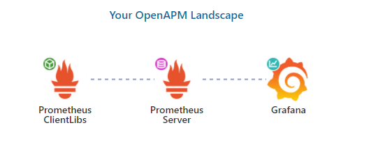

# demo-dotnet-grafana-prometheus

Monitoring a WebAPI with Prometheus and Grafana


[](
https://openapm.io/landscape?instrumentation-lib=prometheus-client-libs&storage=prometheus-server&dashboarding=grafana&showCommercial=true&showFormats=false)

## Run project

### Build image

```bash
docker build -f ./Dockerfile --force-rm -t technobre/demo-api-metrics ..
```

#### Create network
```bash
docker network create --driver bridge demo
```

##### Create and run container
```bash
docker run -d --name=demo-api-metrics --net demo -p 8080:80 -t technobre/demo-api-metrics .
```


## References
- [OpenAPM](https://openapm.io/)
- [Prometheus](https://prometheus.io/docs/prometheus/latest/installation/)
  - [Docker](https://hub.docker.com/r/prom/prometheus)
- [prometheus-net](https://github.com/prometheus-net/prometheus-net)
  - [.NET Runtime collector](https://github.com/djluck/prometheus-net.DotNetRuntime/blob/master/README.md)
- [Grafana](https://grafana.com/docs/grafana/latest/installation/)
  - [Docker](https://hub.docker.com/r/grafana/grafana)
  - [prometheus-net Dashboard](https://github.com/prometheus-net/grafana-dashboards)
    - [ASP.NET Core](https://grafana.com/grafana/dashboards/10915)
    - [.NET Runtime](https://grafana.com/grafana/dashboards/10427)